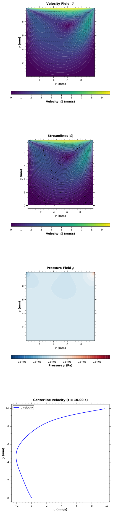
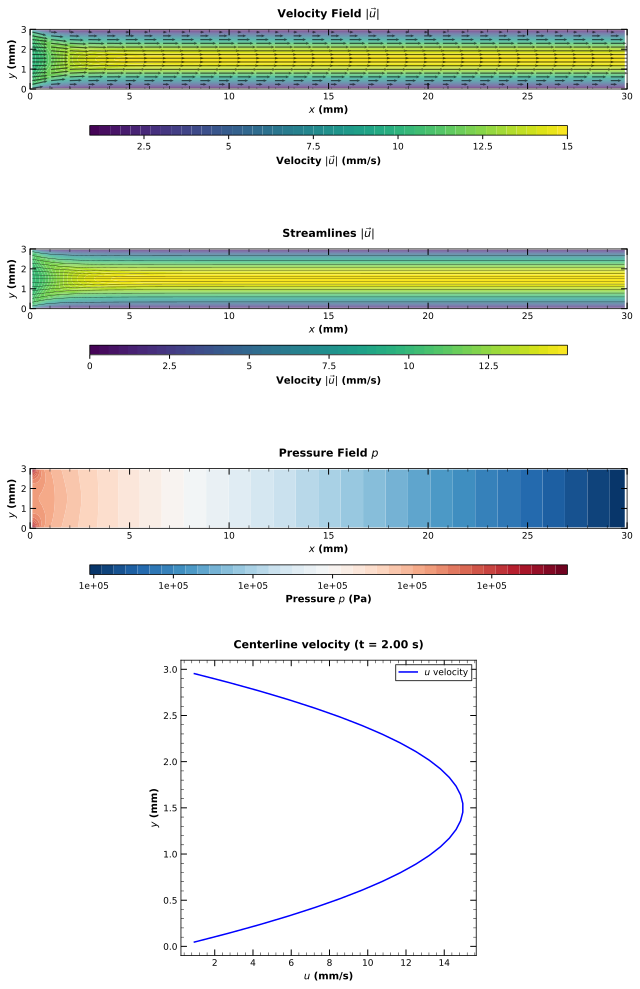
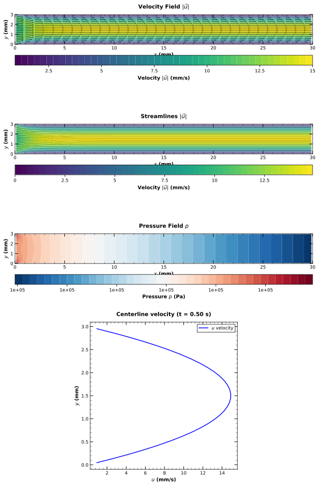
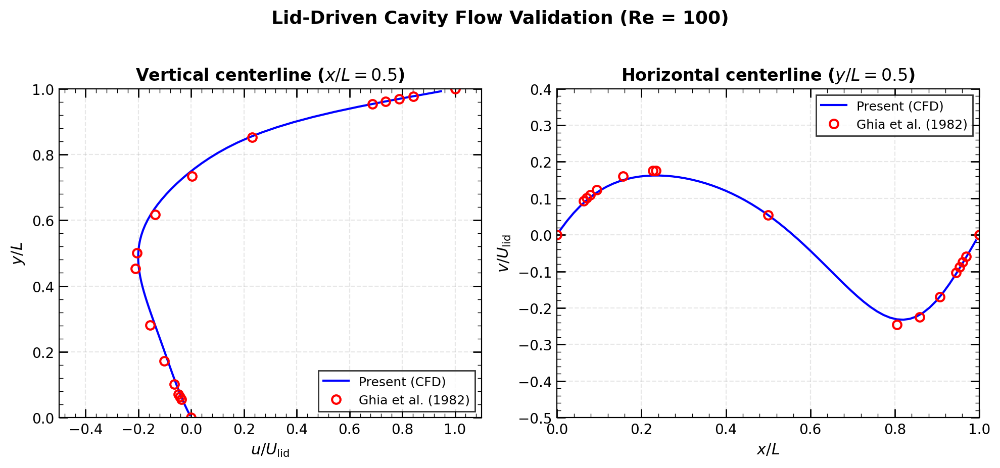

# Incompressible Navier-Stokes Solver

2次元非圧縮性Navier-Stokes方程式のための数値解法ライブラリ。
MAC法（Marker-and-Cell）による空間離散化と、**Projection法**および**SIMPLE法**による時間積分を実装。

## 支配方程式

### Navier-Stokes方程式

$$
\frac{\partial \mathbf{u}}{\partial t} + (\mathbf{u} \cdot \nabla)\mathbf{u} = -\frac{1}{\rho}\nabla p + \nu \nabla^2 \mathbf{u}
$$

$$
\nabla \cdot \mathbf{u} = 0
$$

ここで：
- $\mathbf{u} = (u, v)$: 速度ベクトル (m/s)
- $p$: 圧力 (Pa)
- $\rho$: 密度 (kg/m³)
- $\nu$: 動粘性係数 (m²/s)

## §1 数値解法

### Projection法（時間積分）

Projection法（Chorin, 1968）は、非圧縮性Navier-Stokes方程式の時間積分において最も広く使われる手法の一つである。この手法の核心は、**速度場と圧力場を分離して解く**ことで、計算効率を大幅に向上させる点にある。

#### なぜProjection法を使うのか？

非圧縮性流れでは、速度と圧力が連続の式 $\nabla \cdot \mathbf{u} = 0$ を通じて強く結合している。これを直接解くことは計算コストが高い。Projection法は**Helmholtz-Hodge分解**の原理に基づき、任意のベクトル場を発散なし成分と勾配成分に分解できることを利用する：

$$
\mathbf{w} = \mathbf{u} + \nabla \phi
$$

ここで $\nabla \cdot \mathbf{u} = 0$ である。この性質を使い、まず圧力を無視した「仮の速度場」を計算し、その後圧力によって連続の式を満たすように補正する。

#### アルゴリズム

**Step 1. 予測ステップ（Predictor）**

圧力項を除いた運動量方程式を解き、中間速度場 $\mathbf{u}^*$ を求める：

$$
\frac{\mathbf{u}^* - \mathbf{u}^n}{\Delta t} = -(\mathbf{u}^n \cdot \nabla)\mathbf{u}^n + \nu \nabla^2 \mathbf{u}^n
$$

この段階では連続の式 $\nabla \cdot \mathbf{u}^* = 0$ は一般に満たされない。

**Step 2. 圧力Poisson方程式**

次の時刻で連続の式を満たす圧力場を求める。修正ステップの式の発散をとり $\nabla \cdot \mathbf{u}^{n+1} = 0$ を課すと：

$$
\nabla^2 p^{n+1} = \frac{\rho}{\Delta t} \nabla \cdot \mathbf{u}^*
$$

この楕円型偏微分方程式をSOR法（逐次過緩和法）で反復的に解く。

**Step 3. 修正ステップ（Corrector）**

求めた圧力勾配で中間速度場を補正し、発散なしの速度場を得る：

$$
\mathbf{u}^{n+1} = \mathbf{u}^* - \frac{\Delta t}{\rho} \nabla p^{n+1}
$$

#### Projection法の利点

- **分離解法**: 速度と圧力を別々に解くため、連立方程式を直接解くより効率的
- **物理的直感**: 「圧力は連続の式を満たすように速度場を補正する」という役割が明確
- **実装の容易さ**: 各ステップが標準的な数値手法で解ける

### SIMPLE法（時間積分）

SIMPLE法（Semi-Implicit Method for Pressure-Linked Equations, Patankar & Spalding, 1972）は、定常・非定常流れの両方に適用できる圧力-速度連成解法である。

#### アルゴリズム

1. **仮の速度場を計算**: 仮の圧力場 $p^*$ を用いて運動量方程式を解く
2. **圧力補正方程式を解く**: $p' = p - p^*$ を求める
3. **速度を補正**: $\mathbf{u} = \mathbf{u}^* + \mathbf{u}'$
4. **圧力を更新**: $p = p^* + \alpha_p p'$（緩和係数適用）
5. 収束するまで繰り返し

#### Projection法との比較

| 特徴 | Projection法 | SIMPLE法 |
|------|-------------|----------|
| 時間積分 | 陽的 | 反復的 |
| 適用 | 非定常流れ | 定常/非定常流れ |
| 収束制御 | 時間ステップ | 緩和係数 |

詳細な離散化については [docs/DISCRETIZATION.md](docs/DISCRETIZATION.md) を参照。

### 空間離散化

- **格子**: スタガード格子（MAC格子）
  - 圧力 $p$: セル中心
  - 速度 $u$: セル面（x方向）
  - 速度 $v$: セル面（y方向）

- **移流項**: 1次風上差分
- **拡散項**: 2次中心差分
- **圧力Poisson方程式**: SOR法（Successive Over-Relaxation）

### 安定性条件

CFLおよび粘性条件による適応的時間刻み：

$$
\Delta t \leq \min\left( \frac{\Delta x}{|u|_{\max}}, \frac{\Delta y}{|v|_{\max}}, \frac{\Delta x^2}{4\nu}, \frac{\Delta y^2}{4\nu} \right)
$$

## プロジェクト構成

```
fluid/
├── include/                  # ヘッダファイル
│   ├── Grid.hpp              # 格子・速度場・圧力場
│   ├── Solver.hpp            # Projection法ソルバー
│   ├── SimpleSolver.hpp      # SIMPLE法ソルバー
│   ├── PressureSolver.hpp    # 圧力Poisson方程式ソルバー
│   ├── BoundaryCondition.hpp # 境界条件
│   └── CSVWriter.hpp         # データ出力
├── src/                      # ソースファイル
├── examples/                 # 計算例
│   ├── cavity_flow.cpp       # キャビティ流れ（Projection法）
│   ├── channel_flow.cpp      # チャネル流れ（Projection法）
│   └── channel_flow_simple.cpp # チャネル流れ（SIMPLE法）
├── scripts/                  # 可視化・解析スクリプト
│   ├── visualize.py          # 結果の可視化
│   ├── validation.py         # ベンチマーク検証
│   └── convergence.py        # 収束解析
└── docs/                     # ドキュメント
    ├── DISCRETIZATION.md     # 離散化スキームの詳細
    └── REFERENCES.md         # 参考文献
```

## ビルド

```bash
mkdir build && cd build
cmake ..
make -j4
```

## 使用例

### キャビティ流れ（Lid-driven cavity）

```bash
./cavity_flow [nx] [U_lid] [end_time]
# 例: ./cavity_flow 64 0.01 10.0
```

上壁が一定速度で移動する正方形キャビティ内の流れ。
Ghia et al. (1982) のベンチマークデータとの比較検証が可能。

### チャネル流れ - Projection法

```bash
./channel_flow [nx] [ny] [U_in] [end_time]
# 例: ./channel_flow 128 32 0.01 2.0
```

### チャネル流れ - SIMPLE法

```bash
./channel_flow_simple [nx] [ny] [U_in] [end_time]
# 例: ./channel_flow_simple 128 32 0.01 1.0
```

2枚の平行平板間の圧力駆動流れ。
理論解（放物線速度分布）との比較が可能。

## 可視化

```bash
cd build

# 最終状態の可視化（Projection法）
python ../scripts/visualize.py output/cavity_projection --plot-final
python ../scripts/visualize.py output/channel_projection --plot-final

# SIMPLE法の結果
python ../scripts/visualize.py output/channel_simple --plot-final

# アニメーション生成
python ../scripts/visualize.py output/channel_projection --animation

# ベンチマーク検証（キャビティ流れ）
python ../scripts/validation.py output/cavity_projection

# 収束解析
python ../scripts/convergence.py output/channel_projection
```

## 計算結果

### キャビティ流れ（Lid-driven cavity, Re = 100）

上壁が一定速度で移動する正方形キャビティ内の流れのシミュレーション結果（Projection法）：



▶︎ **左上**: 速度場（ベクトル＋カラーマップ） | **右上**: 流線 | **左下**: 圧力場 | **右下**: 中心線速度分布

▶︎ 主渦が右上に形成され、左下に二次渦が発生している様子が確認できる。

### チャネル流れ（Poiseuille flow, Re = 30）

2枚の平行平板間の圧力駆動流れ。入口で一様流入、出口で自然流出境界条件を設定。

#### Projection法による結果



▶︎ **左上**: 速度場 | **右上**: 流線 | **左下**: 圧力場 | **右下**: 中心線速度分布

#### SIMPLE法による結果



▶︎ **左上**: 速度場 | **右上**: 流線 | **左下**: 圧力場 | **右下**: 中心線速度分布

▶︎ 両手法とも、発達した流れでは放物線状の速度分布（Poiseuille流れの理論解）に近づいていることが確認できる。

### ベンチマーク検証

Ghia, Ghia & Shin (1982) のベンチマークデータとの比較により、数値解の妥当性を検証：



▶︎ 垂直・水平中心線上の速度分布が参照データと良好に一致していることが確認できる。

## 計算性能

MacBook Air (Apple M2, 24GB RAM) での計算時間：

| ケース | 格子サイズ | 手法 | 総ステップ数 | 計算時間 | 1ステップあたり |
|--------|-----------|------|-------------|---------|----------------|
| Cavity Flow (Re=100) | 64×64 | Projection | 1,639 | 7.6 s | 4.6 ms |
| Channel Flow (Re=30) | 128×32 | Projection | 1,056 | 84 s | 79 ms |
| Channel Flow (Re=30) | 128×32 | SIMPLE | 264 | 113 s | 430 ms |

▶︎ Projection法はSIMPLE法に比べて1ステップあたり約10倍高速（圧力ソルバーの収束特性の違いによる）

## 検証

### キャビティ流れ

Ghia, Ghia & Shin (1982) のベンチマークデータとの比較により検証：
- Re = 100, 400, 1000 で良好な一致を確認
- 中心線速度分布の比較

### チャネル流れ

Poiseuille流れの理論解との比較：

$$
U_{\max} = \frac{3}{2} U_{\text{mean}}
$$

$$
u(y) = U_{\max} \left(1 - \frac{4y^2}{H^2}\right)
$$

## 参考文献

詳細は [docs/REFERENCES.md](docs/REFERENCES.md) を参照。

## ライセンス

MIT License
