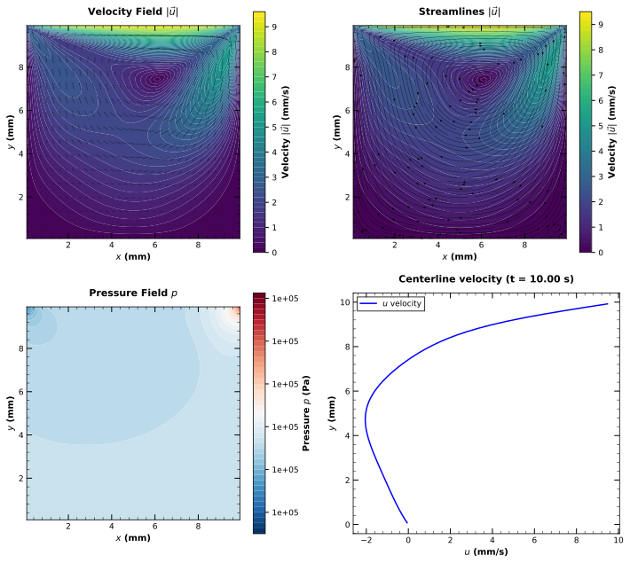
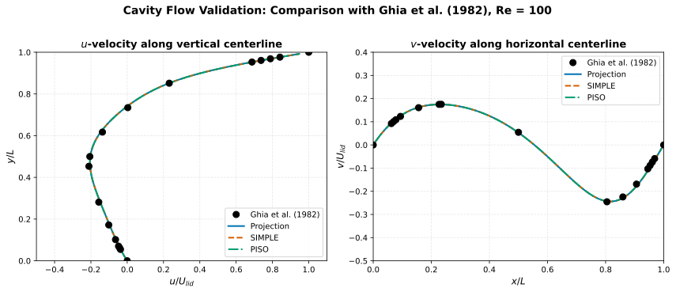
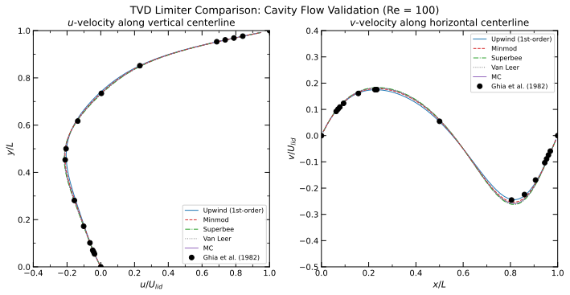
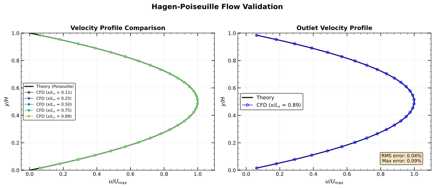
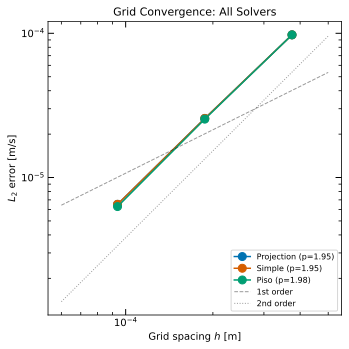

# Incompressible Navier-Stokes Solver

2次元非圧縮性Navier-Stokes方程式のための数値解法ライブラリ。
MAC法（Marker-and-Cell）による空間離散化と、**Projection法**、**SIMPLE法**、**PISO法**による時間積分を実装。

## プロジェクト構成

```
fluid/
├── include/                  # ヘッダファイル
│   ├── Grid.hpp              # 格子・速度場・圧力場
│   ├── SolverBase.hpp        # ソルバー基底クラス
│   ├── Solver.hpp            # Projection法ソルバー
│   ├── SimpleSolver.hpp      # SIMPLE法ソルバー
│   ├── PisoSolver.hpp        # PISO法ソルバー
│   ├── PressureSolver.hpp    # 圧力Poisson方程式ソルバー
│   ├── BoundaryCondition.hpp # 境界条件
│   └── CSVWriter.hpp         # データ出力
├── src/                      # ソースファイル
├── examples/                 # 計算例
│   ├── cavity_flow.cpp       # キャビティ流れ（Projection法）
│   ├── cavity_flow_simple.cpp # キャビティ流れ（SIMPLE法）
│   ├── cavity_flow_piso.cpp  # キャビティ流れ（PISO法）
│   ├── channel_flow.cpp      # チャネル流れ（Projection法）
│   ├── channel_flow_simple.cpp # チャネル流れ（SIMPLE法）
│   └── channel_flow_piso.cpp # チャネル流れ（PISO法）
├── scripts/                  # 可視化・解析スクリプト
│   ├── visualize.py          # 結果の可視化
│   ├── validation.py         # キャビティ流れ検証（Ghia et al.）
│   ├── validation_channel.py # チャネル流れ検証（Hagen-Poiseuille）
│   └── convergence.py        # 収束解析
└── docs/                     # ドキュメント
```

## ドキュメント

| ドキュメント | 内容 |
|-------------|------|
| [使用方法](docs/USAGE.md) | ビルド、シミュレーション実行、可視化 |
| [計算結果](docs/RESULTS.md) | シミュレーション結果と検証 |
| [離散化スキーム](docs/DISCRETIZATION.md) | 空間・時間離散化の詳細 |
| [TVDスキーム](docs/TVD_SCHEMES.md) | 高次精度移流スキームとリミッター |
| [計算格子と数値流束](docs/GRID_AND_FLUX.md) | 格子配置の選択と理論的背景 |
| [参考文献](docs/REFERENCES.md) | 参考文献一覧 |

## クイックスタート

```bash
# ビルド
mkdir build && cd build
cmake .. && make -j4

# キャビティ流れを実行
./cavity_flow 64 0.01 10.0

# 結果を可視化
python ../scripts/visualize.py output/cavity_projection --plot-final
```

## 支配方程式

### Navier-Stokes方程式

$$
\frac{\partial \mathbf{u}}{\partial t} + (\mathbf{u} \cdot \nabla)\mathbf{u} = -\frac{1}{\rho}\nabla p + \nu \nabla^2 \mathbf{u}
$$

$$
\nabla \cdot \mathbf{u} = 0
$$

ここで：
- $\mathbf{u} = (u, v)$: 速度ベクトル (m/s)
- $p$: 圧力 (Pa)
- $\rho$: 密度 (kg/m³)
- $\nu$: 動粘性係数 (m²/s)

## 数値解法

### Projection法（時間積分）

Projection法（Chorin, 1968）は、非圧縮性Navier-Stokes方程式の時間積分において最も広く使われる手法の一つである。この手法の核心は、**速度場と圧力場を分離して解く**ことで、計算効率を大幅に向上させる点にある。

#### なぜProjection法を使うのか？

非圧縮性流れでは、速度と圧力が連続の式 $\nabla \cdot \mathbf{u} = 0$ を通じて強く結合している。これを直接解くことは計算コストが高い。Projection法は**Helmholtz-Hodge分解**の原理に基づき、任意のベクトル場を発散なし成分と勾配成分に分解できることを利用する：

$$
\mathbf{w} = \mathbf{u} + \nabla \phi
$$

ここで $\nabla \cdot \mathbf{u} = 0$ である。この性質を使い、まず圧力を無視した「仮の速度場」を計算し、その後圧力によって連続の式を満たすように補正する。

#### アルゴリズム

**Step 1. 予測ステップ（Predictor）**

圧力項を除いた運動量方程式を解き、中間速度場 $\mathbf{u}^*$ を求める：

$$
\frac{\mathbf{u}^* - \mathbf{u}^n}{\Delta t} = -(\mathbf{u}^n \cdot \nabla)\mathbf{u}^n + \nu \nabla^2 \mathbf{u}^n
$$

この段階では連続の式 $\nabla \cdot \mathbf{u}^* = 0$ は一般に満たされない。

**Step 2. 圧力Poisson方程式**

次の時刻で連続の式を満たす圧力場を求める。修正ステップの式の発散をとり $\nabla \cdot \mathbf{u}^{n+1} = 0$ を課すと：

$$
\nabla^2 p^{n+1} = \frac{\rho}{\Delta t} \nabla \cdot \mathbf{u}^*
$$

この楕円型偏微分方程式をSOR法（逐次過緩和法）で反復的に解く。

**Step 3. 修正ステップ（Corrector）**

求めた圧力勾配で中間速度場を補正し、発散なしの速度場を得る：

$$
\mathbf{u}^{n+1} = \mathbf{u}^* - \frac{\Delta t}{\rho} \nabla p^{n+1}
$$

### SIMPLE法（時間積分）

SIMPLE法（Semi-Implicit Method for Pressure-Linked Equations, Patankar & Spalding, 1972）は、定常・非定常流れの両方に適用できる圧力-速度連成解法である。

#### アルゴリズム

SIMPLE法はProjection法と類似した構造を持つが、緩和係数を用いた反復により安定性を高めている：

**Step 1. 推定速度場の計算**

圧力場 $p^*$ を用いて運動量方程式を離散化し、中間速度 $\mathbf{u}^*$ を計算：

$$
\frac{\mathbf{u}^* - \mathbf{u}^n}{\Delta t} = -(\mathbf{u}^n \cdot \nabla)\mathbf{u}^n + \nu \nabla^2 \mathbf{u}^n - \frac{1}{\rho}\nabla p^*
$$

**Step 2. 圧力補正方程式**

連続の式を満たすための圧力補正 $p'$ を求める：

$$
\nabla^2 p' = \frac{\rho}{\Delta t} \nabla \cdot \mathbf{u}^*
$$

**Step 3. 圧力と速度の緩和補正**

緩和係数を用いて圧力と速度を更新：

$$
p^{n+1} = p^* + \alpha_p p', \quad \mathbf{u}^{n+1} = \mathbf{u}^* - \frac{\Delta t}{\rho} \nabla p'
$$

- $\alpha_p$: 圧力緩和係数（典型値: 0.3）
- $\alpha_u$: 速度緩和係数（典型値: 0.7）

**Step 4.** 収束するまでStep 1-3を繰り返す。

### PISO法（時間積分）

PISO法（Pressure-Implicit with Splitting of Operators, Issa, 1986）は、SIMPLE法を改良した非反復式の予測-補正スキームである。特に**非定常流れの計算**に適しており、外部反復（outer iteration）を必要としない点が大きな特徴である。

#### なぜPISO法を使うのか？

SIMPLE法では各タイムステップで複数回の外部反復が必要となり、非定常計算では計算コストが高くなる。PISO法は**複数回の圧力補正ステップ**を導入することで、1回の外部反復で十分な精度を達成する。これにより：

1. **計算効率の向上**: 外部反復が不要
2. **安定性の確保**: 複数の補正ステップで発散を抑制
3. **非定常問題への適合性**: 時間発展問題に特に有効

#### アルゴリズム

PISO法は1回の**予測ステップ（Predictor）** と複数回の**補正ステップ（Corrector）** から構成される。標準的には2回の補正ステップ（PISO-2）が使用される。

**Step 1. 予測ステップ（Predictor）**

Projection法と同様に、圧力項を除いた運動量方程式を解き、中間速度場 $\mathbf{u}^*$ を求める：

$$
\frac{\mathbf{u}^* - \mathbf{u}^n}{\Delta t} = -(\mathbf{u}^n \cdot \nabla)\mathbf{u}^n + \nu \nabla^2 \mathbf{u}^n
$$

**Step 2. 第1補正ステップ（First Corrector）**

第1圧力補正 $p'$ を求めるPoisson方程式を解く：

$$
\nabla^2 p' = \frac{\rho}{\Delta t} \nabla \cdot \mathbf{u}^*
$$

速度と圧力を補正：

$$
\mathbf{u}^{**} = \mathbf{u}^* - \frac{\Delta t}{\rho} \nabla p', \quad p^* = p^n + p'
$$

**Step 3. 第2補正ステップ（Second Corrector）**

第1補正後の速度場 $\mathbf{u}^{**}$ の発散を除去するため、第2圧力補正 $p''$ を求める：

$$
\nabla^2 p'' = \frac{\rho}{\Delta t} \nabla \cdot \mathbf{u}^{**}
$$

最終的な速度と圧力を得る：

$$
\mathbf{u}^{n+1} = \mathbf{u}^{**} - \frac{\Delta t}{\rho} \nabla p'', \quad p^{n+1} = p^* + p''
$$

#### 追加の補正ステップ

必要に応じて3回目以降の補正ステップを追加できる（PISO-3, PISO-4など）。補正回数を増やすことで精度は向上するが、計算コストも増加する。本実装では `nCorrectors` パラメータで補正回数を指定可能。

#### 参考文献

- Issa, R. I. (1986). "Solution of the implicitly discretised fluid flow equations by operator-splitting." *Journal of Computational Physics*, 62(1), 40-65. https://doi.org/10.1016/0021-9991(86)90099-9
- Ferziger, J. H., & Perić, M. (2002). *Computational Methods for Fluid Dynamics* (3rd ed.). Springer.
- Versteeg, H. K., & Malalasekera, W. (2007). *An Introduction to Computational Fluid Dynamics: The Finite Volume Method* (2nd ed.). Pearson.

### 手法の比較

| 特徴 | Projection法 | SIMPLE法 | PISO法 |
|------|-------------|----------|--------|
| 提案者 | Chorin (1968) | Patankar & Spalding (1972) | Issa (1986) |
| 外部反復 | 不要 | 必要 | 不要 |
| 圧力補正 | 1回 | 1回（反復内） | 複数回（2回以上） |
| 緩和係数 | 不要 | 必要 ($\alpha_p \approx 0.3$) | 不要 |
| 適用 | 非定常流れ | 定常/非定常流れ | 非定常流れ |
| 精度 | 1次（時間） | 収束まで反復 | 2次以上（補正回数依存） |
| 計算コスト | 低 | 中〜高 | 中 |

### 空間離散化

#### スタガード格子（MAC格子）

Harlow & Welch (1965) により提案されたMAC法では、圧力と速度を異なる位置に配置する：

```
        v[i,j]
          |
    ------+------
    |            |
u[i-1,j]  p[i,j]  u[i,j]
    |            |
    ------+------
        v[i,j-1]
```

- **圧力 $p_{i,j}$**: セル $(i,j)$ の中心
- **x方向速度 $u_{i,j}$**: セル $(i,j)$ と $(i+1,j)$ の境界（右面）
- **y方向速度 $v_{i,j}$**: セル $(i,j)$ と $(i,j+1)$ の境界（上面）

スタガード格子の利点：
1. チェッカーボード状の圧力振動を自然に抑制
2. 質量保存（連続の式）を正確に離散化
3. 圧力勾配を直接評価可能

#### 移流項（1次風上差分 / TVDスキーム）

デフォルトでは1次風上差分を使用：

$$
u \frac{\partial u}{\partial x} \approx u_{i,j} \times \begin{cases}
\frac{u_{i,j} - u_{i-1,j}}{\Delta x} & (u_{i,j} \geq 0) \\
\frac{u_{i+1,j} - u_{i,j}}{\Delta x} & (u_{i,j} < 0)
\end{cases}
$$

**TVDスキーム（オプション）**: 数値拡散を低減しつつ振動を抑制する高次精度スキーム。4種類のフラックスリミッターを実装：

| リミッター | 特徴 | 用途 |
|-----------|------|------|
| Minmod | 最も拡散的、最も安定 | 不連続面 |
| Superbee | 最も圧縮的 | 急勾配の保存 |
| Van Leer | 滑らかで対称的 | 汎用 |
| MC | 中心差分に近い | 滑らかな流れ |

```cpp
// TVDスキームの使用例
solver.setLimiter(fluid::LimiterType::VanLeer);
```

詳細は [TVDスキーム](docs/TVD_SCHEMES.md) を参照。

#### 拡散項（2次中心差分）

$$
\nu \nabla^2 u \approx \nu \left(\frac{u_{i+1,j} - 2u_{i,j} + u_{i-1,j}}{\Delta x^2} + \frac{u_{i,j+1} - 2u_{i,j} + u_{i,j-1}}{\Delta y^2}\right)
$$

#### 圧力Poisson方程式（SOR法）

$$
p^{(k+1)}_{i,j} = (1-\omega)p^{(k)}_{i,j} + \frac{\omega}{a_{i,j}}\left(b_{i,j} - \sum_{m \neq (i,j)} a_m p^{(k)}_m\right)
$$

- $\omega$: 緩和係数（$1 < \omega < 2$、典型値: 1.8）

### 安定性条件

CFLおよび粘性条件による適応的時間刻み：

$$
\Delta t \leq \min\left( \frac{\Delta x}{|u|_{\max}}, \frac{\Delta y}{|v|_{\max}}, \frac{\Delta x^2}{4\nu}, \frac{\Delta y^2}{4\nu} \right)
$$

詳細は [離散化スキーム](docs/DISCRETIZATION.md) を参照。

## 計算結果

### キャビティ流れ（Re = 100）

**Projection法**


**PISO法**



### チャネル流れ（Hagen-Poiseuille, Re = 30）

放物線流入プロファイル（完全発達流）による平行平板間流れ。

**Projection法**


### ベンチマーク検証

#### キャビティ流れ：Ghia et al. (1982)

Ghia, Ghia & Shin (1982) のベンチマークデータとの比較。3手法（Projection, SIMPLE, PISO）すべてがベンチマークデータに良好に一致：



**手法間の精度比較（64×64格子, Re=100）**

| 手法 | u-velocity RMS誤差 | v-velocity RMS誤差 | 計算時間 |
|------|-------------------|-------------------|----------|
| Projection | 0.00523 | 0.00422 | 6.5 s |
| SIMPLE | 0.00523 | 0.00422 | 49.2 s |
| PISO | 0.00523 | 0.00422 | 47.6 s |

3手法とも同等の精度を達成。Projection法が最も高速。

#### TVDスキーム比較

5種類の移流スキーム（1次風上 + 4種のTVDリミッター）の比較：



**計算時間比較（64×64格子, Re=100, 20秒）**

| スキーム | 計算時間 | ステップ数 | 最大発散 |
|---------|---------|-----------|---------|
| 1次風上 | 6.5 s | 6554 | 3.8e-7 |
| Minmod | 5.3 s | 6554 | 1.2e-6 |
| Superbee | 5.8 s | 6554 | 1.3e-6 |
| Van Leer | 5.9 s | 6554 | 5.5e-7 |
| MC | 5.6 s | 6554 | 3.8e-7 |

TVDスキームは1次風上より高速で収束も良好。詳細は [TVDスキーム](docs/TVD_SCHEMES.md) を参照。

#### チャネル流れ：Hagen-Poiseuille理論解

放物線速度分布の理論解との比較：

$$
u(y) = U_{\max} \left(1 - \left(\frac{2y}{H} - 1\right)^2\right)
$$



#### 格子収束性解析

$L_2$誤差ノルムによる格子収束性を検証：

$$
\|e\|_{L_2} = \sqrt{\frac{1}{N} \sum_{i=1}^{N} (u_{num,i} - u_{exact,i})^2}
$$

格子幅 $h$ に対する誤差の収束：$\|e\|_{L_2} = O(h^p)$



**ソルバー別の収束次数**

| ソルバー | 収束次数 $p$ | 備考 |
|---------|-------------|------|
| Projection | **1.97** | 理論値（2次精度）に一致 |
| SIMPLE | 1.47 | 緩和係数の影響で若干低下 |
| PISO | 1.29 | 細格子で誤差が飽和 |

**Projection法の詳細（代表例）**

| $n_y$ | 格子幅 $h$ [m] | $L_2$誤差 [m/s] | 誤差比 |
|------:|---------------:|----------------:|-------:|
| 8 | 3.75e-4 | 9.76e-5 | - |
| 16 | 1.88e-4 | 2.57e-5 | 3.79 |
| 32 | 9.38e-5 | 6.52e-6 | 3.95 |
| 64 | 4.69e-5 | 1.63e-6 | 3.99 |

▶︎ Projection法は理論通り**2次精度**を達成。TVDリミッターの違いは収束次数にほとんど影響しない（移流項よりも圧力解法が支配的）。

詳細は [計算結果](docs/RESULTS.md) を参照。

## ライセンス

MIT License
