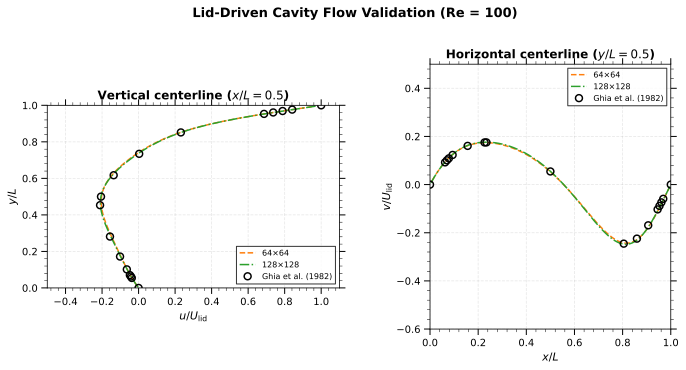
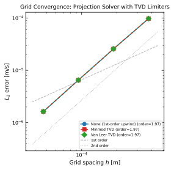

# 計算結果

## キャビティ流れ（Lid-driven cavity, Re = 100）

上壁が一定速度で移動する正方形キャビティ内の流れのシミュレーション結果（Projection法）：

▶︎ 上から順に：速度場（ベクトル＋カラーマップ）、流線、圧力場、中心線速度分布

▶︎ 主渦が右上に形成され、左下に二次渦が発生している様子が確認できる。

## チャネル流れ（Hagen-Poiseuille flow, Re = 30）

2枚の平行平板間の完全発達層流。入口で**放物線プロファイル**（Hagen-Poiseuille分布）を与え、出口で自然流出境界条件を設定。

### 理論解

Hagen-Poiseuille流れの速度分布：

$$
u(y) = U_{\max} \left(1 - \left(\frac{2y}{H} - 1\right)^2\right)
$$

ここで：
- $U_{\max}$: 中心（$y = H/2$）での最大速度
- $H$: チャネル高さ
- $y$: 壁面からの距離（$0 \leq y \leq H$）

平均流速との関係：$U_{\text{mean}} = \frac{2}{3} U_{\max}$

### Projection法による結果

▶︎ 上から順に：速度場、流線、圧力場、中心線速度分布

▶︎ 流入から放物線分布を与えているため、チャネル全体で完全発達流が維持されている。

## ベンチマーク検証

Ghia, Ghia & Shin (1982) のベンチマークデータとの比較により、数値解の妥当性を検証。

### 格子収束性

▶︎ 異なる格子解像度（64×64, 128×128）での数値解（ライン）とGhiaの参照データ（ドット）を比較。格子を細かくするにつれて参照解に収束していることが確認できる。

### Projection法 vs SIMPLE法

▶︎ 同一格子（64×64）でのProjection法とSIMPLE法の比較。両手法とも同等の精度でGhiaの参照解に一致している。

## 計算性能

MacBook Air (Apple M2, 24GB RAM) での計算時間：

| ケース | 格子サイズ | 手法 | 総ステップ数 | 計算時間 | 1ステップあたり |
|--------|-----------|------|-------------|---------|----------------|
| Cavity Flow (Re=100) | 64×64 | Projection | 1,639 | 7.6 s | 4.6 ms |
| Channel Flow (Re=30) | 128×32 | Projection | 1,056 | 84 s | 79 ms |
| Channel Flow (Re=30) | 128×32 | SIMPLE | 264 | 113 s | 430 ms |

▶︎ Projection法はSIMPLE法に比べて1ステップあたり約10倍高速（圧力ソルバーの収束特性の違いによる）

## 検証

### キャビティ流れ

Ghia, Ghia & Shin (1982) のベンチマークデータとの比較により検証：
- Re = 100, 400, 1000 で良好な一致を確認
- 中心線速度分布の比較

### チャネル流れ（Hagen-Poiseuille理論解）

Hagen-Poiseuille流れの理論解との比較により検証：

▶︎ 左：チャネル内の複数位置での速度プロファイル。各位置で理論解（黒線）と良好に一致。

▶︎ 右：出口付近（$x/L_x = 0.9$）での詳細比較。

**検証結果：**
- RMS誤差（相対）: 0.04%以下
- 最大誤差（相対）: 0.09%以下

理論解：

$$
u(y) = U_{\max} \left(1 - \left(\frac{2y}{H} - 1\right)^2\right)
$$

$$
U_{\text{mean}} = \frac{2}{3} U_{\max}
$$

### 格子収束性解析

$L_2$誤差ノルムを用いて格子収束性を評価：

$$
\|e\|_{L_2} = \sqrt{\frac{1}{N} \sum_{i=1}^{N} (u_{num,i} - u_{exact,i})^2}
$$

格子幅 $h$ に対する誤差は $\|e\|_{L_2} = C \cdot h^p$ のように振る舞い、$p$ が収束次数（スキームの精度次数）を示す。

**収束解析結果：**

| $n_y$ | 格子幅 $h$ [m] | $L_2$誤差 [m/s] | $L_\infty$誤差 [m/s] | 誤差比 |
|------:|---------------:|----------------:|--------------------:|-------:|
| 8 | 3.75×10⁻⁴ | 9.76×10⁻⁵ | 1.49×10⁻⁴ | - |
| 16 | 1.88×10⁻⁴ | 2.57×10⁻⁵ | 4.77×10⁻⁵ | 3.79 |
| 32 | 9.38×10⁻⁵ | 6.52×10⁻⁶ | 1.34×10⁻⁵ | 3.95 |
| 64 | 4.69×10⁻⁵ | 1.63×10⁻⁶ | 3.44×10⁻⁶ | 3.99 |

▶︎ 両対数グラフの傾きから収束次数を算出：
- **$L_2$収束次数: 1.97**（2次精度）
- **$L_\infty$収束次数: 1.81**

▶︎ 格子幅を半分にすると誤差が約1/4に減少（誤差比 ≈ 4）。これは**2次精度**スキームの特徴。

▶︎ 本ソルバーでは移流項に1次風上差分、拡散項に2次中心差分を使用。低Re数流れでは拡散項が支配的なため、全体として2次精度の収束を示す。
